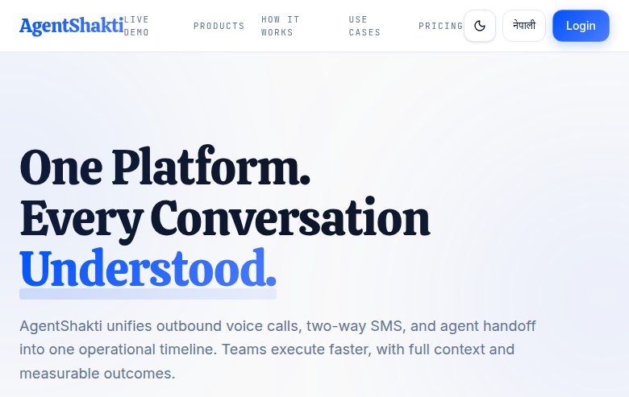
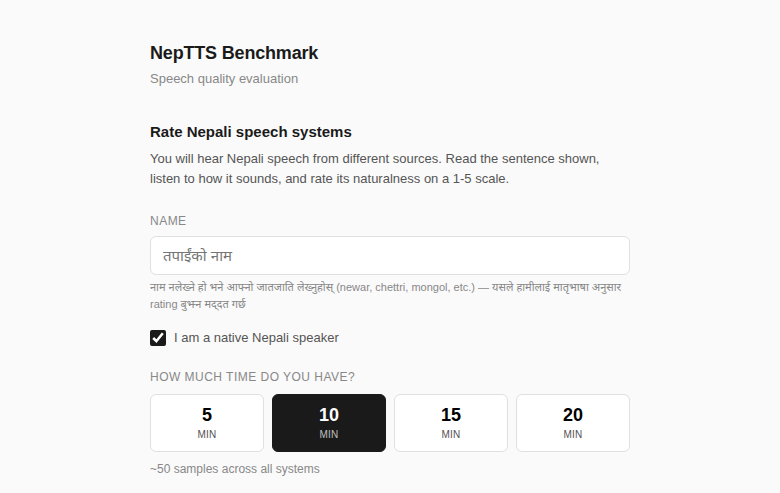
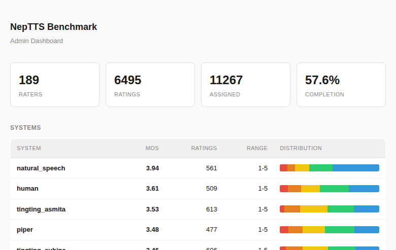
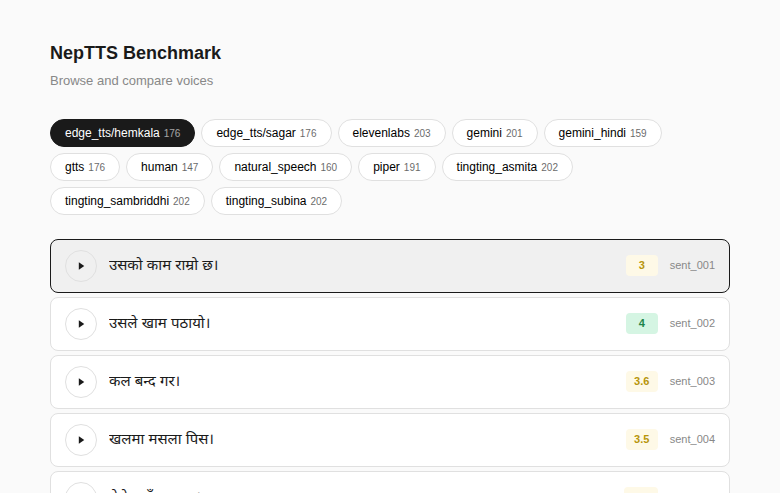
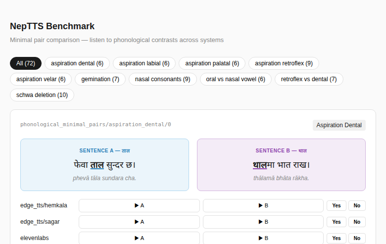
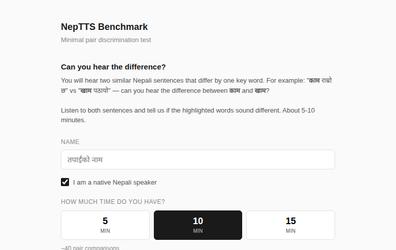
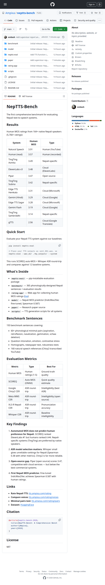
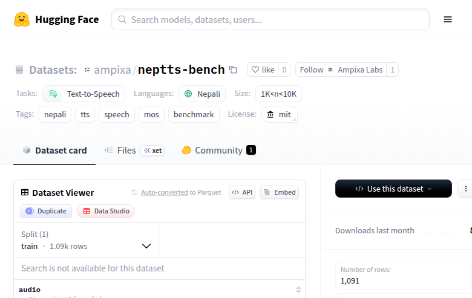

# NepTTS-Bench: Progress Report

## Overview

We have built the first comprehensive benchmark for evaluating Nepali text-to-speech systems. The benchmark is complete with human evaluation data, automated metrics, a trained MOS predictor, and open-source tooling.

**Repository:** https://github.com/Ampixa/neptts-bench
**Dataset:** https://huggingface.co/datasets/ampixa/neptts-bench
**Live rating app:** https://tts.ampixa.com/rating

## Data Collected

| Metric | Count |
|--------|-------|
| Native Nepali raters | 189 |
| Human MOS ratings | 6,495 |
| TTS systems evaluated | 12 |
| Benchmark sentences | 205 |
| Phonological minimal pairs | 77 |
| Pair discrimination ratings | 54 |
| Automated ASR metrics | 5 systems |
| Auto-MOS (SCOREQ) | Complete |

## Main Results

### Human MOS Rankings (1-5 scale, 189 raters)

| Rank | System | Human MOS | Type | Ratings |
|------|--------|----------|------|---------|
| 1 | Natural speech (YouTube) | 3.94 | Human reference | 561 |
| 2 | Human (read speech) | 3.61 | Human reference | 509 |
| 3 | TingTing Asmita | 3.53 | Nepali-specific TTS | 613 |
| 4 | Piper | 3.48 | Open source (VITS) | 477 |
| 5 | TingTing Subina | 3.46 | Nepali-specific TTS | 606 |
| 6 | ElevenLabs v3 | 3.44 | Cloud (ElevenLabs) | 471 |
| 7 | Edge TTS Hemkala | 3.35 | Cloud (Microsoft) | 579 |
| 8 | Edge TTS Sagar | 3.34 | Cloud (Microsoft) | 573 |
| 9 | Gemini (Hindi mode) | 3.28 | Cloud (Google) | 477 |
| 10 | Gemini Flash | 3.21 | Cloud (Google) | 580 |
| 11 | TingTing Sambriddhi | 3.16 | Nepali-specific TTS | 579 |
| 12 | gTTS | 2.56 | Cloud (Google Translate) | 470 |

### Automated Metrics (9 TTS systems)

| System | SCOREQ MOS | Chirp2 CER | MMS CER | XLS-R CER |
|--------|-----------|-----------|---------|-----------|
| ElevenLabs v3 | **4.45** | **0.106** | 0.278 | 0.222 |
| TingTing Subina | 4.27 | 0.120 | **0.181** | **0.160** |
| TingTing Asmita | 4.17 | 0.141 | 0.234 | 0.198 |
| Gemini Flash | 4.10 | 0.144 | 0.214 | 0.199 |
| Edge TTS Sagar | 3.63 | 0.146 | 0.279 | 0.148 |
| Edge TTS Hemkala | 3.74 | 0.170 | 0.301 | 0.161 |
| Piper | 3.49 | 0.186 | 0.291 | 0.168 |
| TingTing Sambriddhi | 4.05 | 0.216 | 0.313 | 0.234 |
| gTTS | 3.02 | 0.473 | 0.531 | 0.279 |

### Cross-Metric Correlations (Spearman)

|  | SCOREQ | Chirp2 | MMS | XLS-R | Whisper |
|--|--------|--------|-----|-------|---------|
| SCOREQ | 1.000 | 0.883* | 0.733* | 0.050 | 0.383 |
| Chirp2 | | 1.000 | 0.867* | 0.350 | 0.367 |
| MMS | | | 1.000 | 0.450 | 0.350 |
| XLS-R | | | | 1.000 | -0.033 |
| Whisper | | | | | 1.000 |

*p < 0.05

## Key Findings

### 1. Automated MOS ≠ Human Preference for Nepali
SCOREQ (auto-MOS trained on English) ranked ElevenLabs #1 (4.45) but humans ranked it #6 (3.44). The Nepali-specific TingTing systems are consistently preferred by native speakers despite lower automated scores. This demonstrates that **existing MOS predictors are unreliable for low-resource languages** and motivates our Nepali-specific predictor.

### 2. Nepali-Specific TTS Is Competitive
TingTing (a Nepal-based TTS provider) outperforms global cloud services (Google Gemini, Microsoft Edge TTS) on human ratings. This shows that language-specific training can compensate for smaller scale.

### 3. Open-Source TTS Is Surprisingly Good
Piper (fully open source, runs locally) scored 3.48 — higher than ElevenLabs and Edge TTS. This is encouraging for applications where cloud dependency is impractical.

### 4. ASR Model Selection Critically Affects Evaluation
Using 5 different ASR systems for round-trip evaluation, we found Whisper small gives essentially random rankings for Nepali (Spearman 0.38 with other metrics). Google Chirp2 is far more reliable. **Studies using Whisper for non-English TTS evaluation should report this caveat.**

### 5. First Nepali MOS Predictor
We trained the first Nepali-specific MOS predictor by fine-tuning IndicWav2Vec on our 6,495 human ratings:
- Architecture: IndicWav2Vec base (top 4 layers unfrozen) + MLP head
- **Spearman correlation: 0.587** with human ratings
- This is "decent" — production-quality models achieve 0.7+, but this is the first for Nepali
- Scaling law: performance improved from 0.19 (1K ratings) → 0.41 (2.7K) → 0.59 (5.7K)

## Deliverables

### Completed
1. **Benchmark sentence set** — 205 sentences, 77 minimal pairs covering 9 phonological contrast categories
2. **12-system evaluation** — human MOS + 6 automated metrics
3. **Rating web application** — MOS rating + pair discrimination test, deployed at tts.ampixa.com/rating
4. **neptts-eval package** — CLI/Python tool for benchmarking any Nepali TTS system
5. **NepaliMOS predictor** — IndicWav2Vec fine-tuned model (Spearman 0.587)
6. **GitHub repo** — https://github.com/Ampixa/neptts-bench
7. **HuggingFace dataset** — https://huggingface.co/datasets/ampixa/neptts-bench
8. **Paper draft** — LaTeX source ready for submission

### In Progress
- Collecting more pair discrimination ratings (54 so far, need 200+)
- Recruiting more raters to improve MOS predictor (target: 10K ratings for Spearman 0.7+)

### Commercial Application: AgentShakti

This research directly feeds into **AgentShakti** (https://agentshakti.xyz) — a unified business communication platform we built that uses Nepali TTS for automated voice calls, two-way SMS, and agent handoff. AgentShakti serves banking, healthcare, and telecom sectors in Nepal.

The NepTTS-Bench findings directly inform which TTS system AgentShakti uses for outbound Nepali voice calls — selecting the system that native speakers rate highest ensures better customer experience. The NepaliMOS predictor will enable real-time quality monitoring of generated speech in production.

### Future Work
- Publish neptts-eval to PyPI
- HuggingFace Spaces leaderboard
- Improve MOS predictor with more data and autoresearch-style experimentation
- Add more TTS systems (AI4Bharat IndicTTS, MMS-TTS)
- Cross-dialect analysis (ratings by ethnic group / mother tongue)
- Integration of NepaliMOS predictor into AgentShakti for real-time quality monitoring

## Screenshots

### Rating App — Registration

### Admin Dashboard — 189 raters, 6,495 ratings

### Voice Browser — Compare all systems

### Minimal Pairs — Phonological contrast testing

### Pair Discrimination Test — Structured listening test

### GitHub Repository

### HuggingFace Dataset

